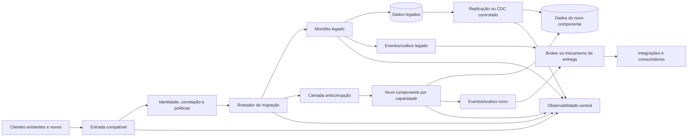

# Arquitetura proposta para migração incremental de monólito crítico

## 1. Resumo executivo

A abordagem recomendada é uma migração incremental baseada no padrão *strangler*, preservando os contratos atuais dos clientes e mantendo o monólito operacional durante a transição.

A arquitetura deve:

- manter uma fachada de entrada estável para os clientes;
- direcionar cada capacidade funcional para o monólito ou para o novo componente;
- estabelecer uma única fonte de verdade por domínio ou agregado;
- evitar dual-write síncrono como padrão;
- permitir comparação entre legado e destino antes da ativação;
- suportar reversão de tráfego sem presumir reversão automática de dados;
- medir continuamente compatibilidade funcional, desempenho, integridade e efeitos operacionais.

A migração deve começar por uma fatia funcional de risco controlado, preferencialmente uma capacidade com baixo acoplamento, critérios claros de sucesso e possibilidade de reconciliação.

---

## 2. Fatos fornecidos

- Existe um monólito considerado crítico.
- O sistema precisa ser migrado.
- Clientes existentes devem continuar utilizando o sistema durante a migração.
- A interrupção dos clientes é indesejada.
- Não foram informados:
  - stack tecnológica;
  - arquitetura de infraestrutura;
  - modelo de dados;
  - volume e perfil de tráfego;
  - contratos externos;
  - requisitos regulatórios;
  - arquitetura-alvo;
  - prazo;
  - equipe disponível;
  - tolerância a inconsistência ou degradação.

A arquitetura abaixo é, portanto, uma referência tecnológica e operacional. Os componentes concretos devem ser escolhidos após o inventário do ambiente atual.

---

## 3. Hipóteses de trabalho

Estas hipóteses permitem definir uma arquitetura inicial, mas precisam ser validadas:

- Os clientes acessam o monólito por APIs, interfaces web, jobs, integrações ou uma combinação desses canais.
- É possível introduzir uma camada de roteamento ou fachada sem alterar imediatamente os clientes.
- O monólito pode continuar em produção durante parte significativa da migração.
- As capacidades do sistema podem ser identificadas e separadas em fatias funcionais.
- Existe algum mecanismo para observar requisições, erros, latência e alterações de dados.
- Os dados possuem algum identificador estável para permitir rastreamento e reconciliação.
- Parte dos fluxos pode ser migrada sem exigir uma transação distribuída entre legado e destino.

Se qualquer uma dessas hipóteses for falsa, a estratégia deve ser ajustada antes da implementação.

---

## 4. Princípios arquiteturais

### 4.1 Compatibilidade antes de modernização

O primeiro objetivo da nova arquitetura é preservar o comportamento observável dos clientes. Modernizações de linguagem, banco, fornecedor ou modelo de negócio devem ser separadas quando não forem indispensáveis à migração.

### 4.2 Uma fonte de verdade por fluxo

Cada entidade ou agregado deve possuir um sistema responsável por suas gravações em cada etapa.

A regra recomendada é:

- enquanto uma capacidade não foi migrada, o monólito permanece como fonte de verdade;
- após a migração, o novo componente passa a ser o escritor principal daquela capacidade;
- o monólito acessa o novo componente por contrato definido, caso ainda precise consumir seus dados;
- não devem existir dois escritores independentes para o mesmo estado sem uma estratégia explícita de consistência e reconciliação.

### 4.3 Roteamento reversível

O tráfego deve poder ser direcionado novamente ao legado quando houver regressão de aplicação, desempenho ou operação.

Essa reversão não deve ser apresentada como rollback completo. Dados já alterados, eventos publicados e efeitos externos podem exigir reconciliação ou compensação.

### 4.4 Contratos estáveis

A camada de compatibilidade deve preservar:

- autenticação e autorização observáveis;
- formatos de requisição e resposta;
- códigos de erro;
- semântica de idempotência;
- paginação e ordenação;
- comportamento de callbacks;
- limites e tempos de resposta compatíveis.

### 4.5 Migração por risco, não apenas por módulo

A ordem deve considerar:

- criticidade do fluxo;
- volume;
- acoplamento;
- complexidade de dados;
- reversibilidade;
- impacto de erro;
- capacidade de observação;
- facilidade de reconciliação.

---

## 5. Arquitetura lógica de referência



A arquitetura é lógica. “Entrada compatível”, “roteador”, “broker” e “CDC” podem ser implementados por tecnologias diferentes conforme o ambiente existente.

---

## 6. Componentes

### 6.1 Camada de entrada compatível

Responsável por fornecer um ponto de acesso estável aos clientes.

Funções:

- receber requisições;
- validar autenticação básica e formato;
- preservar ou criar identificadores de correlação;
- aplicar limites de tráfego;
- encaminhar para o legado ou para a nova implementação;
- registrar decisões de roteamento;
- permitir ativação gradual por cliente, grupo, região, capacidade ou percentual.

Essa camada não deve absorver regras de negócio complexas. Regras incorporadas apenas para viabilizar a migração tendem a se tornar um novo monólito.

### 6.2 Roteador de migração

Responsável por decidir qual implementação atenderá cada requisição.

Critérios possíveis:

- capacidade funcional;
- versão do contrato;
- cliente ou grupo de clientes;
- tenant;
- região;
- percentual controlado;
- identificador de entidade;
- modo de operação;
- condição de emergência.

O roteador deve ter:

- configuração versionada;
- mudança auditável;
- ativação e desativação rápidas;
- validação de regras conflitantes;
- comportamento seguro quando a configuração estiver indisponível;
- proteção contra roteamento inconsistente para a mesma entidade.

Para fluxos com estado, é preferível manter afinidade por entidade ou agregado durante a transição.

### 6.3 Camada anticorrupção

A camada anticorrupção adapta o contrato legado para o modelo do novo componente sem permitir que conceitos internos do monólito contaminem o novo domínio.

Responsabilidades:

- mapear formatos;
- normalizar códigos e estados;
- traduzir erros;
- adaptar autenticação contextual;
- converter identificadores;
- proteger o novo componente de dependências específicas do legado;
- impedir que consultas diretas ao banco legado se espalhem pela nova solução.

Ela deve ser temporária quando possível. Caso permaneça indefinidamente, deve ser tratada como componente operacional permanente, com testes e ownership definidos.

### 6.4 Novos componentes por capacidade

Cada fatia migrada deve ter fronteira funcional explícita.

Um componente migrado normalmente contém:

- API ou interface de entrada;
- regras da capacidade;
- persistência própria ou acesso controlado ao armazenamento;
- publicação de eventos;
- integração com serviços externos;
- métricas e logs próprios;
- procedimentos de recuperação.

Não é necessário transformar imediatamente cada parte em um microserviço. Um modular monolith ou um serviço por grupo de capacidades pode ser mais seguro se reduzir a complexidade operacional.

### 6.5 Persistência

A persistência deve ser definida por capacidade, e não apenas pela tecnologia usada.

Durante a transição, podem coexistir:

- banco legado;
- armazenamento do novo componente;
- tabelas de controle de migração;
- mecanismo de eventos;
- registros de reconciliação;
- armazenamento temporário de idempotência.

O novo componente não deve depender indefinidamente de tabelas internas do monólito. Se essa dependência for necessária no início, deve possuir:

- contrato de leitura documentado;
- controle de versão;
- limites de acesso;
- plano explícito de remoção.

### 6.6 Sincronização e eventos

A estratégia preferencial é:

1. carga inicial dos dados;
2. replicação das alterações posteriores;
3. validação de completude e consistência;
4. ativação controlada do novo escritor;
5. manutenção temporária dos mecanismos de reconciliação.

Quando o legado suporta eventos confiáveis, uma combinação de *outbox* e entrega idempotente é preferível a capturas frágeis baseadas apenas em consultas periódicas.

CDC, *outbox*, replicação por lote ou outra alternativa devem ser escolhidos após conhecer o banco, o volume e as garantias necessárias.

### 6.7 Integrações externas

Integrações com parceiros devem ser isoladas por adaptadores ou gateways de integração.

Cada integração deve especificar:

- timeout;
- retentativas;
- backoff;
- idempotência;
- limites de chamada;
- tratamento de respostas parciais;
- autenticação;
- callbacks;
- compensação;
- correlação de requisições;
- comportamento em indisponibilidade.

O novo componente não deve duplicar chamadas externas apenas para manter dois sistemas sincronizados. Em especial, operações financeiras, notificações, reservas e movimentações de estoque exigem controle de efeitos colaterais.

### 6.8 Controle de migração

Deve existir um repositório ou configuração controlada para registrar:

- capacidades migradas;
- clientes incluídos;
- versão ativa;
- percentual de tráfego;
- sistema escritor;
- data de ativação;
- critérios de pausa;
- autoridade de aprovação;
- estado de reconciliação;
- exceções e bloqueios.

Alterações nesse controle devem ser auditáveis e reversíveis no nível de roteamento.

---

## 7. Fluxos principais

### 7.1 Requisição de leitura antes da migração

1. Cliente envia requisição para a entrada compatível.
2. A camada de entrada valida autenticação, correlação e formato.
3. O roteador identifica que a capacidade ainda pertence ao legado.
4. O monólito processa a requisição.
5. A resposta é adaptada ao contrato externo.
6. Métricas, logs e rastreamento são registrados.

### 7.2 Requisição de leitura em validação

1. O cliente envia uma requisição normal.
2. O legado continua sendo responsável pela resposta.
3. A mesma entrada é avaliada pelo novo componente em modo de comparação, quando seguro.
4. A resposta do novo componente não é exposta ao cliente.
5. Um comparador verifica:
   - status;
   - campos relevantes;
   - ordenação;
   - regras de paginação;
   - tempos de resposta;
   - diferenças esperadas.
6. Divergências são classificadas e encaminhadas para análise.

Esse modo não deve ser usado para repetir efeitos colaterais.

### 7.3 Requisição de escrita antes da migração

1. A requisição é encaminhada ao monólito.
2. O monólito grava o estado.
3. O evento ou registro de alteração é publicado de forma confiável.
4. O novo componente, se necessário, atualiza uma projeção ou réplica.
5. Falhas de entrega ficam pendentes para retentativa e reconciliação.

### 7.4 Requisição de escrita após a migração

1. O roteador encaminha a requisição ao novo componente.
2. O novo componente valida idempotência e autorização.
3. A alteração é persistida na fonte de verdade definida.
4. O evento correspondente é registrado de forma transacional com a alteração, quando aplicável.
5. Consumidores recebem o evento de forma idempotente.
6. O monólito é atualizado apenas se ainda precisar consumir o estado e se isso fizer parte do contrato de transição.
7. Falhas posteriores não devem gerar uma segunda gravação do comando original sem controle de idempotência.

### 7.5 Falha durante a migração

A resposta deve depender da etapa da falha:

- falha antes da gravação: retentar ou retornar erro seguro;
- falha após gravação local: consultar o estado antes de retentar;
- falha na publicação de evento: recuperar a partir do outbox;
- falha em integração externa: aplicar política específica de idempotência e compensação;
- divergência de dados: interromper o avanço da fatia e executar reconciliação;
- degradação de latência ou erro: reduzir tráfego ou voltar o roteamento ao legado.

### 7.6 Reversão

A reversão deve separar quatro ações:

1. **Reversão de tráfego:** redirecionar novas requisições ao legado.
2. **Reversão de configuração:** restaurar a política anterior do roteador.
3. **Tratamento de dados:** identificar alterações feitas no novo componente.
4. **Compensação:** corrigir efeitos externos ou estados irreversíveis.

O procedimento de reversão deve ser testado antes do primeiro corte real.

---

## 8. Estratégia de dados

### 8.1 Classificação por tipo de operação

| Tipo de fluxo | Estratégia inicial recomendada |
|---|---|
| Consulta sem efeito colateral | Comparação em sombra e posterior roteamento gradual |
| Consulta derivada ou relatório | Réplica, projeção ou carga independente |
| Cadastro simples | Migração com escritor único e reconciliação |
| Alteração com regras críticas | Corte controlado, idempotência e compensação |
| Pagamento, estoque ou faturamento | Migração individualizada, com validação operacional e fonte de verdade explícita |
| Notificação ou webhook | Controle de duplicidade e registro de entrega |
| Job agendado | Execução exclusiva por capacidade, com lock e controle de versão |

### 8.2 Migração de dados

A sequência recomendada é:

1. identificar entidades e relacionamentos;
2. definir o proprietário de cada dado;
3. criar mapeamento entre modelos;
4. executar carga inicial;
5. validar contagens, totais e invariantes;
6. habilitar captura de alterações;
7. acompanhar atraso da replicação;
8. executar reconciliação completa;
9. ativar leituras;
10. ativar escritas;
11. manter janela de observação;
12. desligar dependências antigas somente após evidência.

### 8.3 Reconciliação

A reconciliação deve verificar, no mínimo:

- registros ausentes;
- duplicidades;
- estados incompatíveis;
- divergência de valores;
- timestamps inválidos;
- referências quebradas;
- eventos não processados;
- alterações fora de ordem;
- diferenças de autorização;
- efeitos externos sem confirmação.

Cada divergência deve ter classificação:

- esperada;
- transitória;
- corrigível automaticamente;
- corrigível manualmente;
- bloqueadora para avanço.

### 8.4 Dual-write

Dual-write síncrono só deve ser usado quando todos os pontos abaixo forem atendidos:

- a operação é idempotente;
- o modelo de falha parcial é conhecido;
- existe reconciliação automatizada;
- há definição de fonte de verdade;
- os efeitos externos não serão duplicados;
- existe procedimento de compensação;
- o custo de divergência foi aceito pelo responsável do domínio.

Na ausência dessas garantias, é preferível escolher um escritor e sincronizar o outro lado por eventos ou processo controlado.

---

## 9. Integrações e contratos

Antes do corte, deve ser construído um inventário de:

- clientes externos;
- aplicações internas;
- jobs;
- consumidores de eventos;
- webhooks;
- integrações com parceiros;
- consultas diretas ao banco;
- relatórios;
- scripts operacionais;
- dependências manuais.

Para cada contrato, registrar:

- consumidor;
- produtor;
- frequência;
- criticidade;
- autenticação;
- formato;
- limites;
- timeout;
- política de erro;
- idempotência;
- compatibilidade esperada;
- responsável;
- evidência de uso real.

A compatibilidade deve ser testada com contratos automatizados e amostras reais anonimizadas quando permitido.

---

## 10. Requisitos não funcionais

Os valores abaixo devem ser definidos pelo negócio e pela operação. Sem números aprovados, a equipe não terá um critério objetivo de sucesso.

### Disponibilidade e continuidade

Definir:

- disponibilidade mínima por capacidade;
- indisponibilidade máxima aceitável;
- RTO;
- RPO;
- tempo máximo para alterar o roteamento;
- janela máxima para contenção de regressões;
- comportamento durante indisponibilidade parcial.

A meta de perda de dados deve ser explicitamente zero quando o domínio não admitir perda.

### Desempenho

Medir separadamente:

- latência p50, p95 e p99;
- taxa de erro;
- throughput;
- tempo em dependências;
- atraso de filas ou replicação;
- tempo de reconciliação;
- impacto causado pelo modo de comparação.

A nova implementação não deve ser considerada compatível apenas porque retorna o mesmo payload.

### Escalabilidade

A arquitetura deve definir como escalar:

- entrada;
- roteador;
- componentes migrados;
- armazenamento;
- processamento assíncrono;
- reconciliação;
- observabilidade.

A capacidade de escalar deve ser validada com tráfego representativo, incluindo picos e comportamento de dependências externas.

### Consistência

Para cada fluxo, documentar:

- consistência forte ou eventual;
- atraso máximo aceitável;
- comportamento em leitura imediatamente após escrita;
- ordenação de eventos;
- política para duplicidade;
- política para processamento fora de ordem.

### Recuperação

Devem existir:

- backups testados;
- restauração validada;
- procedimentos de falha;
- runbooks;
- testes de reversão;
- contato de responsáveis;
- classificação de incidentes;
- procedimentos de reconciliação e compensação.

### Compatibilidade

Preservar, salvo decisão explícita:

- contratos públicos;
- semântica de autenticação;
- códigos de erro;
- limites;
- ordenação;
- paginação;
- formatos de data e horário;
- precisão numérica;
- comportamento de retentativas;
- callbacks.

---

## 11. Segurança

### Identidade e acesso

- Manter compatibilidade de autenticação durante a transição.
- Evitar que o novo componente confie apenas em cabeçalhos enviados pelo cliente.
- Revalidar identidade e autorização na fronteira de cada componente.
- Definir propagação segura de identidade e contexto.
- Aplicar privilégio mínimo para serviços, jobs e operadores.
- Separar permissões de leitura, escrita, migração e administração.

### Proteção de dados

- Classificar dados sensíveis antes de copiá-los.
- Minimizar dados replicados.
- Criptografar dados em trânsito e em repouso conforme os controles disponíveis.
- Controlar acesso a dumps, arquivos de migração e logs.
- Não registrar segredos ou dados sensíveis desnecessários.
- Aplicar retenção e descarte compatíveis com as regras da organização.

Não foram fornecidas leis, normas ou requisitos regulatórios específicos. A conformidade aplicável deve ser confirmada com as áreas jurídica, de segurança e de privacidade.

### Integridade e não repúdio operacional

- Registrar quem autorizou cada etapa.
- Auditar mudanças de roteamento.
- Auditar correções manuais de dados.
- Proteger registros de eventos e reconciliação contra alteração indevida.
- Usar identificadores de correlação e idempotência.
- Alertar sobre reprocessamentos anormais, duplicidades e alterações fora do fluxo esperado.

### Segurança da migração

- Isolar credenciais de migração.
- Expirar acessos temporários.
- Restringir acesso direto aos bancos.
- Validar imagens, pacotes e artefatos de implantação.
- Executar testes de segurança antes de aumentar o tráfego.
- Tratar a camada de compatibilidade como superfície de ataque, não apenas como infraestrutura transitória.

---

## 12. Observabilidade

A observabilidade deve permitir responder rapidamente:

- qual cliente foi afetado;
- qual capacidade falhou;
- qual implementação atendeu a requisição;
- qual versão estava ativa;
- qual dado foi alterado;
- qual dependência falhou;
- se houve divergência entre legado e destino;
- se o problema é de tráfego, aplicação, dados ou integração;
- se a reversão é segura.

### Logs estruturados

Cada requisição ou operação deve conter, quando aplicável:

- identificador de correlação;
- identificador de cliente ou tenant não sensível;
- capacidade;
- implementação escolhida;
- versão;
- resultado;
- latência;
- código de erro;
- identificador de idempotência;
- identificador de entidade;
- dependência acionada.

### Métricas

Métricas mínimas:

- requisições por implementação;
- erro por capacidade e cliente;
- latência por percentil;
- taxa de fallback;
- decisões de roteamento;
- divergências de resposta;
- divergências de dados;
- atraso de replicação;
- tamanho de filas;
- eventos não processados;
- retentativas;
- duplicidades;
- falhas de integração;
- volume de compensações;
- tempo de reconciliação;
- consumo de recursos.

### Rastreamento distribuído

Quando houver múltiplos componentes, o rastreamento deve acompanhar:

```text
cliente → entrada → roteador → componente → persistência → evento → consumidor externo
```

O mesmo contexto de correlação deve ser propagado com controles para evitar exposição indevida de dados.

### Alertas

Alertas de parada ou reversão devem considerar:

- aumento sustentado de erros;
- regressão de latência;
- divergência acima do limite;
- perda ou atraso de eventos;
- falha de reconciliação;
- duplicidade de efeitos externos;
- saturação de dependências;
- comportamento diferente por grupo de clientes;
- quebra de autorização ou autenticação.

Os limites precisam ser definidos antes do corte, não durante o incidente.

---

## 13. Plano de implementação

### Fase 0 — Definição de objetivos e limites

Entregáveis:

- escopo da migração;
- métricas de sucesso;
- limites de indisponibilidade, erro, latência e divergência;
- definição de “sem interrupção”;
- responsáveis pela aprovação;
- domínios excluídos da primeira etapa.

Critério de saída: objetivos mensuráveis aprovados.

### Fase 1 — Descoberta e inventário

Mapear:

- arquitetura atual;
- consumidores;
- contratos;
- fluxos críticos;
- dados;
- integrações;
- jobs;
- acessos diretos;
- dependências ocultas;
- procedimentos operacionais.

Produzir uma matriz de criticidade, acoplamento, reversibilidade e observabilidade.

Critério de saída: nenhum consumidor crítico conhecido sem responsável e sem estratégia de compatibilidade.

### Fase 2 — Preparação da plataforma de transição

Implementar:

- entrada compatível;
- correlação;
- roteamento controlado;
- configuração auditável;
- métricas e logs;
- mecanismo de fallback;
- testes de contrato;
- procedimento de reversão.

Critério de saída: o tráfego pode ser direcionado entre legado e destino em ambiente controlado.

### Fase 3 — Escolha da primeira fatia

Selecionar uma capacidade que:

- tenha fronteira relativamente clara;
- não dependa de transação distribuída complexa;
- tenha volume controlável;
- permita reconciliação;
- produza benefício mensurável;
- não concentre o maior risco financeiro ou operacional.

Critério de saída: fonte de verdade, estratégia de dados e plano de recuperação definidos para a fatia.

### Fase 4 — Implementação e validação

Executar:

- implementação do novo componente;
- mapeamentos;
- carga inicial;
- sincronização;
- testes de contrato;
- testes de comportamento;
- testes de carga;
- testes de falha;
- comparação em sombra;
- reconciliação.

Critério de saída: divergências conhecidas, classificadas e dentro dos limites aprovados.

### Fase 5 — Ativação gradual

Sequência sugerida:

1. tráfego interno ou sintético;
2. cliente controlado;
3. pequeno grupo de baixo risco;
4. aumento gradual;
5. cobertura ampliada;
6. ativação da escrita;
7. período de observação;
8. encerramento da dependência antiga.

Cada aumento deve exigir validação dos indicadores e aprovação definida previamente.

### Fase 6 — Estabilização e retirada

Após a estabilização:

- encerrar rotas não utilizadas;
- remover sincronizações temporárias;
- eliminar acessos diretos ao modelo antigo;
- revisar permissões;
- atualizar documentação;
- validar backups e recuperação;
- definir prazo final para desligamento da capacidade legada.

O legado não deve ser desligado apenas porque o novo componente respondeu corretamente durante um período curto.

---

## 14. Critérios de avanço, pausa e reversão

### Avançar quando

- os testes de contrato forem aprovados;
- a carga inicial estiver reconciliada;
- o atraso de sincronização estiver dentro do limite;
- não houver divergência bloqueadora;
- a equipe de operação conhecer o runbook;
- o procedimento de reversão tiver sido exercitado;
- os responsáveis tiverem aprovado a próxima etapa.

### Pausar quando

- houver divergência sem causa conhecida;
- o desempenho estiver próximo do limite;
- o volume de retentativas crescer;
- uma dependência externa apresentar comportamento incompatível;
- a reconciliação estiver incompleta;
- a equipe não conseguir sustentar a operação dupla;
- surgirem efeitos colaterais não previstos.

### Reverter o tráfego quando

- a taxa de erro exceder o limite;
- houver risco de perda ou duplicidade de dados;
- permissões estiverem incorretas;
- a latência causar impacto relevante;
- houver falha de integridade;
- a causa não puder ser contida rapidamente.

A reversão deve ser acompanhada por um plano de tratamento dos dados já processados.

---

## 15. Riscos residuais

| Risco | Impacto | Mitigação |
|---|---|---|
| Dependência não inventariada | Interrupção inesperada | Observação de tráfego, análise de código e validação com consumidores |
| Divergência de dados | Decisões incorretas e retrabalho | Fonte de verdade, reconciliação e limites de corte |
| Dual-write inconsistente | Estados incompatíveis | Escritor único, eventos idempotentes e compensação |
| Rollback incompleto | Duplicidade ou perda lógica | Separação entre tráfego, aplicação, dados e efeitos externos |
| Contrato aparentemente compatível, mas semanticamente diferente | Regressão para clientes | Testes de comportamento e comparação de respostas |
| Operação de dois sistemas | Aumento de carga operacional | Runbooks, ownership, prazo de convivência e automação |
| Integração externa não idempotente | Efeitos duplicados | Chaves de idempotência, deduplicação e compensação |
| Observabilidade insuficiente | Detecção tardia | Métricas por versão, cliente, capacidade e fluxo |
| Migração de muitos eixos ao mesmo tempo | Causa de falha difícil de identificar | Separar migração funcional de modernizações não essenciais |

---

## 16. Decisões pendentes

Antes do desenho detalhado, devem ser respondidas:

- O que exatamente será migrado: infraestrutura, banco, runtime, arquitetura ou capacidades?
- Quais fluxos não toleram inconsistência temporária?
- Qual é a fonte de verdade de cada agregado?
- Há necessidade real de transação distribuída?
- Quais clientes podem participar da primeira fatia?
- Qual indisponibilidade é aceitável em contingência?
- Qual é o limite de latência e erro?
- Quais efeitos externos são irreversíveis?
- Quais contratos precisam permanecer inalterados?
- Quais dados podem ser replicados e em que condições?
- Quem pode autorizar avanço, pausa e reversão?
- Qual é a data ou condição objetiva para retirar o legado?
- A equipe possui capacidade operacional para manter os dois caminhos?

---

## 17. Recomendação final

Adotar uma arquitetura de transição com:

- fachada de entrada estável;
- roteamento por capacidade e grupo controlado;
- componentes novos com fronteiras funcionais claras;
- escritor único por domínio;
- migração de dados por carga inicial, sincronização e reconciliação;
- testes em sombra somente para operações sem efeitos colaterais;
- eventos idempotentes para propagação;
- observabilidade comparativa;
- reversão de tráfego testada;
- compensação explícita para efeitos irreversíveis.

O primeiro marco não deve ser “substituir o monólito”. Deve ser demonstrar, em uma fatia delimitada, que a organização consegue operar legado e destino simultaneamente, preservar contratos, detectar divergências, corrigir dados e reverter tráfego com segurança. A partir dessa evidência, a migração pode avançar progressivamente sem transformar a continuidade dos clientes em uma suposição não mensurável.
