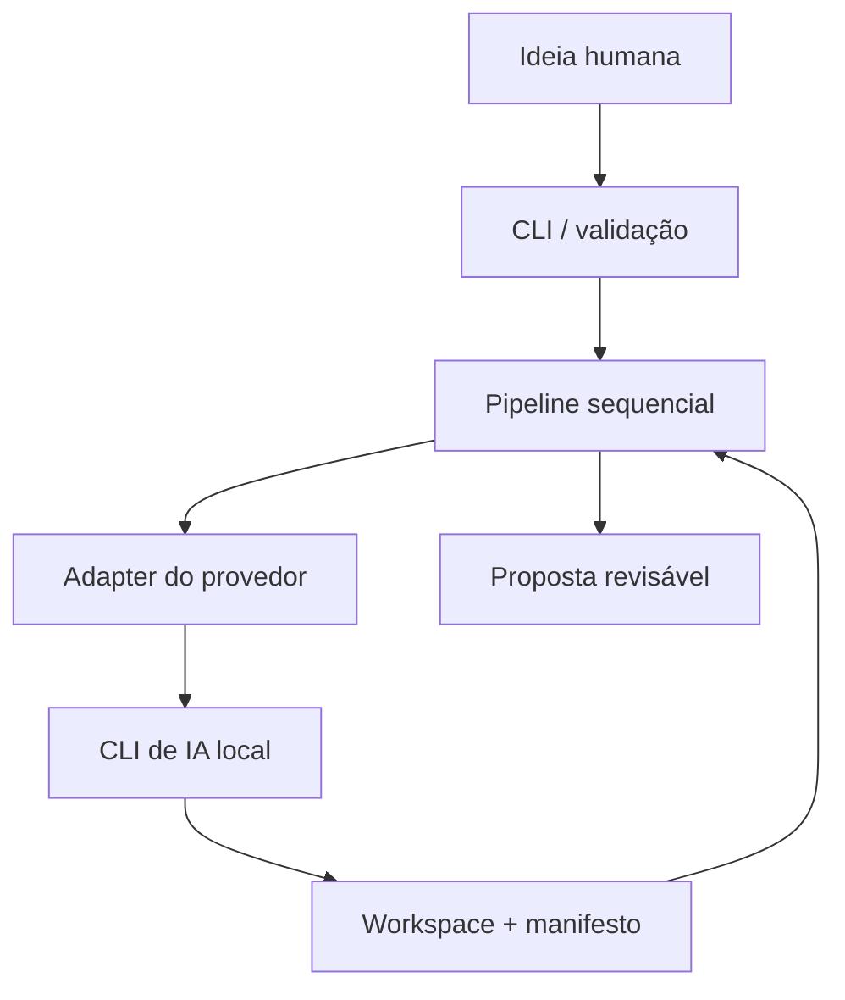
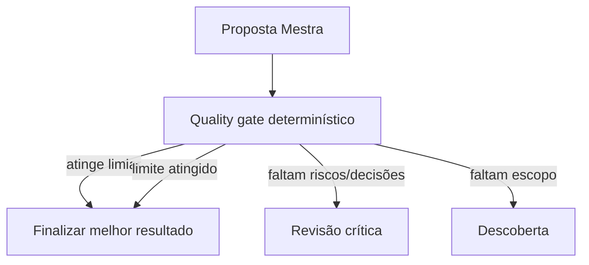

# Arquitetura do OmniCLI

## Fluxo principal

## Loop condicional (opt-in)

O modo legado continua sendo uma sequência completa repetida. O modo `--refine` adiciona apenas um roteador pequeno e limitado ao final da esteira:

O roteamento não é um editor de grafos nem um mecanismo de agentes concorrentes. `--loops` limita passagens, `quality_loop.max_steps` limita etapas, e o manifesto registra o histórico, o melhor score e o motivo de término. O quality gate atual é deliberadamente híbrido: calcula sinais determinísticos de completude e bloqueia marcadores de segurança/contradições críticas explicitamente detectados; não afirma que um documento está correto apenas porque atingiu um número.

## Decisões da V1

### Subprocessos locais

Os provedores são executados como processos locais. Essa escolha evita acoplamento inicial a APIs específicas, mas não elimina dependências de autenticação, versões, quotas ou mudanças de interface.

### Adaptadores

O orquestrador não espalha detalhes particulares de Gemini, Claude, Codex ou Copilot pelo pipeline. Cada provedor é descrito no YAML e executado pelo `SubprocessAdapter`. Uma integração que exigir protocolo próprio poderá implementar `ProviderAdapter` dedicado.

O transporte é inferido pela configuração:

- se `args` contém o argumento isolado `{prompt}`, o conteúdo é enviado como um único item de `argv`;
- sem o placeholder, o conteúdo é enviado por `stdin`;
- nenhuma invocação utiliza shell;
- `max_prompt_chars` limita crescimento acidental de contexto.

Os defaults usam as interfaces headless documentadas: `gemini -p`, `claude -p` e `codex exec`. Copilot permanece desabilitado até que o usuário defina um contrato headless documentado e compatível com sua versão.

### Contexto entre etapas

Cada etapa recebe a ideia original e a saída da etapa anterior. O prompt orienta crítica e expansão, evitando concordância automática. As entradas são delimitadas como dados não confiáveis para reduzir propagação de prompt injection. Em ciclos legados adicionais, o último resultado retorna ao início do pipeline. No modo de refinamento, a saída da proposta mestra é avaliada e o retorno pode ser direcionado a uma etapa específica, preservando o contexto e evitando trabalho redundante.

### Persistência

O workspace mantém um manifesto JSON e artefatos por etapa. O manifesto é atualizado após cada etapa concluída ou falha, com versão do provedor, timestamps, tamanhos e hashes SHA-256. Isso permite diagnóstico e verificação de integridade sem depender apenas da saída do terminal.

### Segurança

O OmniCLI não é sandbox. Os subprocessos herdam o contexto do usuário. A V1 não executa código gerado nem altera repositórios automaticamente.

Consulte [threat-model.md](threat-model.md) para limites, riscos residuais e pré-condições do futuro modo de implementação.

## Contrato de etapa

Cada etapa define:

- `name`: identificador único;
- `provider`: chave do adaptador;
- `role`: função editorial/técnica;
- `instruction`: objetivo da etapa;
- `timeout_seconds`: limite de execução;
- `max_retries`: número máximo de novas tentativas.

## Evolução prevista

O modo de implementação deverá gerar alterações em workspace temporário, apresentar diff e aguardar aprovação antes de aplicar qualquer mudança. Autocorreção deverá seguir o mesmo modelo: diagnóstico, patch, testes e aprovação.

O roadmap atual prioriza contratos de compatibilidade, pipeline packs e avaliações antes de ampliar autonomia. Veja [ROADMAP.md](../ROADMAP.md). O loop condicional não executa código, não altera repositórios e não substitui aprovação humana.
