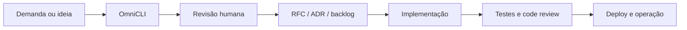

# Uso do OmniCLI no fluxo de engenharia

## Em uma frase

O OmniCLI transforma uma demanda ainda ambígua em uma proposta de engenharia revisável antes do início da implementação.

Seu valor principal não é escrever código automaticamente. Ele organiza a etapa anterior ao código: descoberta do problema, crítica de premissas, arquitetura, viabilidade e consolidação das decisões.

## Onde ele entra no processo

O encaixe recomendado é entre a entrada da demanda e o refinamento técnico:



O OmniCLI não substitui as etapas de implementação, testes, revisão de código, segurança ou aprovação arquitetural. Ele melhora a qualidade do material que chega a essas etapas.

## O que o pipeline produz

O pipeline padrão conduz a ideia por papéis complementares. Os nomes e provedores são configuráveis em YAML.

| Etapa | Objetivo | Saída útil para a equipe |
| --- | --- | --- |
| Descoberta | Expandir a ideia e identificar problema, público, objetivos, funcionalidades e lacunas | Contexto do problema e perguntas em aberto |
| Revisão crítica | Questionar premissas, contradições, riscos, dependências e excesso de escopo | Pontos frágeis que precisam de decisão |
| Arquitetura | Estruturar componentes, fluxos, dados, integrações, segurança e observabilidade | Primeira proposta técnica coerente |
| Viabilidade | Avaliar complexidade, dependências, custos, riscos operacionais e alternativas simples | Limites, trade-offs e opções de menor risco |
| Proposta mestra | Consolidar escopo, requisitos, arquitetura, riscos, critérios de aceite e decisões pendentes | Documento-base para RFC, ADR e backlog |

Cada etapa recebe a ideia original e o resultado anterior. As instruções orientam os provedores a separar fatos, hipóteses e recomendações, sinalizar incertezas e não tratar o conteúdo de entrada como instrução de sistema.

## Benefícios para a engenharia

O uso é especialmente valioso quando o processo sofre com demandas vagas, decisões prematuras, perda de contexto ou retrabalho após o início do desenvolvimento.

Os ganhos esperados são:

- tornar premissas e lacunas visíveis antes da implementação;
- encontrar riscos de integração, segurança e operação mais cedo;
- evitar transformar uma ideia pequena em uma arquitetura maior que a evidência disponível;
- produzir critérios de aceite e decisões pendentes mais claros;
- melhorar o alinhamento entre produto, engenharia, segurança, QA e operações;
- preservar a discussão como um artefato revisável, em vez de deixá-la apenas em conversas;
- permitir repetir ou retomar uma execução sem perder as etapas concluídas;
- comparar propostas com base em escopo, riscos, decisões e evidências registradas.

O benefício não é simplesmente obter mais texto de uma IA. O ganho vem de transformar uma conversa em um processo repetível, com etapas, limites, artefatos e revisão humana.

## Modo de uso recomendado

### 1. Prepare um briefing curto

Comece com a informação disponível, mesmo que incompleta. Não tente inventar requisitos para fazer a entrada parecer completa.

Exemplo:

> Precisamos integrar nossa API de pedidos com um novo provedor de pagamentos, antifraude, CRM e notificações. O volume inicial, os provedores e os requisitos de disponibilidade ainda não foram definidos.

### 2. Execute uma ou duas passagens

Para um primeiro uso, uma passagem já é suficiente:

```bash
omnicli conceive \
  "Precisamos integrar nossa API de pedidos com um novo provedor de pagamentos, antifraude, CRM e notificações. O volume inicial ainda não foi definido." \
  --loops 1 \
  --output docs/rfc/integracao-pagamentos.md \
  --preview
```

Quando a proposta precisar de refinamento, use o loop condicional:

```bash
omnicli conceive \
  "Precisamos integrar nossa API de pedidos com um novo provedor de pagamentos, antifraude, CRM e notificações. O volume inicial ainda não foi definido." \
  --loops 3 \
  --refine \
  --output docs/rfc/integracao-pagamentos.md \
  --verbose
```

O modo `--refine` usa um quality gate determinístico para verificar sinais de completude, como escopo, riscos, decisões e critérios de aceite. Ele pode retornar a proposta para uma etapa específica, respeitando limites de passos e chamadas.

### 3. Revise os artefatos por etapa

Não leia apenas a proposta final. O workspace da execução contém os resultados individuais e um `manifest.json`. Use os artefatos para verificar:

- quais afirmações são fatos e quais são hipóteses;
- quais decisões foram sugeridas, mas ainda não aprovadas;
- quais riscos foram identificados;
- quais informações continuam bloqueando uma decisão;
- se a arquitetura está proporcional ao primeiro incremento;
- se os critérios de aceite são verificáveis.

Para consultar uma execução posteriormente:

```bash
omnicli run inspect RUN_ID
omnicli run inspect RUN_ID --json
omnicli run resume RUN_ID --idea "A ideia original, quando a retenção estiver em hash-only"
```

### 4. Faça a revisão humana

A proposta não deve ser aprovada automaticamente. Produto, engenharia e os especialistas do domínio devem confirmar contratos externos, volume, prazo, segurança, privacidade, custos e decisões de negócio.

### 5. Converta a proposta em artefatos do processo

Depois da revisão, use o documento como base para:

- RFC ou documento de solução;
- ADRs para decisões arquiteturais;
- épico e histórias técnicas;
- critérios de aceite e cenários de teste;
- checklist de riscos e dependências;
- plano de rollout, observabilidade e recuperação.

O OmniCLI fornece a matéria-prima. A aprovação e a adaptação ao padrão da organização continuam sendo responsabilidades da equipe.

## Casos de uso

### Nova integração ou API

Use para explorar idempotência, webhooks, retries, timeouts, falhas parciais, compensação, observabilidade e dependências dos provedores antes de implementar adapters e endpoints.

É um caso particularmente adequado para pagamentos, antifraude, ERP, CRM, notificações e mensageria.

### Feature com escopo incerto

Use quando a demanda está descrita apenas como “precisamos de um sistema” ou “precisamos adicionar suporte a X”. A saída ajuda a definir um primeiro incremento, o que fica fora do escopo e quais perguntas precisam ser respondidas antes do backlog.

### Revisão ou evolução de arquitetura

Forneça o problema atual e as restrições conhecidas para comparar alternativas, como monólito modular, eventos, filas, novos serviços ou uma evolução incremental. O resultado serve como insumo para uma revisão arquitetural, não como decisão automática.

### Dados sensíveis ou regulados

Use para levantar retenção, auditoria, controle de acesso, revisão humana, exposição a provedores externos e riscos de erro silencioso. A ferramenta ajuda a revelar questões; ela não substitui jurídico, privacidade, segurança ou compliance.

### Handoff entre equipes

Use a proposta como registro de contexto quando uma equipe faz a descoberta e outra executa. Escopo, fora de escopo, premissas, riscos, critérios de aceite e decisões pendentes ficam disponíveis em um único artefato.

### Registro de decisão técnica

Use a seção de decisões e consequências como base para ADRs. Por exemplo, uma recomendação de outbox transacional pode ser convertida em uma decisão formal com motivo, consequências, riscos e critérios de validação.

## Exemplo de resultado esperado

Para uma integração de pagamentos, uma boa proposta deve evitar afirmar que todos os provedores, volumes ou SLAs já estão definidos quando eles não foram fornecidos. Ela pode recomendar, como primeiro incremento:

- um único provedor confirmado;
- uma fatia vertical de pagamento ponta a ponta;
- eventos assíncronos para CRM e notificações;
- idempotência para escritas e webhooks;
- logs estruturados e poucas métricas de negócio;
- adiamento de broker dedicado, múltiplos provedores e reconciliação até haver evidência operacional.

Esse tipo de resultado reduz o risco de construir uma plataforma completa antes de validar o fluxo principal.

## Como avaliar se trouxe valor

Trate a adoção como uma melhoria de processo. Durante um piloto, acompanhe:

- tempo entre a abertura da demanda e a aprovação da proposta;
- quantidade de ciclos de esclarecimento com produto;
- requisitos descobertos somente depois do início da implementação;
- mudanças arquiteturais tardias;
- riscos encontrados antes do desenvolvimento;
- propostas que viraram RFC, ADR ou backlog;
- latência, quantidade de chamadas e consumo de quota;
- retrabalho causado por requisitos ausentes.

O resultado positivo não é gerar mais documentos. É tomar decisões melhores antes de comprometer código, infraestrutura e prazo.

## Limites e cuidados

O OmniCLI 0.4 é uma base de beta controlada para pilotos técnicos locais. Atualmente ele:

- não executa código gerado;
- não altera repositórios automaticamente;
- não executa shell como parte do pipeline;
- não é um sandbox;
- não substitui testes, code review, análise de segurança ou aprovação humana;
- não garante que uma proposta esteja correta porque ela atingiu um score de qualidade;
- não oferece IA gratuita: os provedores continuam sujeitos a assinatura, quota, licença e política de privacidade;
- ainda depende da compatibilidade das CLIs instaladas e autenticadas.

Não envie segredos, dados pessoais ou material sensível sem revisar as políticas do provedor e os controles do ambiente. O conteúdo original fica em hash por padrão, mas os provedores ainda recebem o contexto necessário para executar as etapas. Consulte o [modelo de ameaças](threat-model.md) antes de usar dados sensíveis.

Para validar o ambiente sem gerar conteúdo:

```bash
omnicli doctor --offline --json
omnicli conceive "Minha ideia" --dry-run --json
omnicli lab verify --json
```

Esses comandos verificam configuração, plano e contratos locais sintéticos. Eles não comprovam qualidade humana, autenticação, compatibilidade completa com um fornecedor ou custo real.

## Recomendação para adoção

Comece por um único caso recorrente e de risco moderado, preferencialmente uma integração de backend ou uma feature com várias dependências:

1. use demandas reais, mas sem dados sensíveis;
2. execute uma ou duas passagens;
3. faça revisão humana obrigatória;
4. converta a saída em RFC, ADR ou backlog;
5. compare com demandas semelhantes planejadas manualmente;
6. meça retrabalho, tempo de esclarecimento e riscos descobertos.

O OmniCLI tende a trazer mais valor quando o problema atual é transformar melhor uma demanda em uma decisão técnica implementável. Se o problema for apenas escrever código mais rápido, ele não é a ferramenta principal.

## Documentação relacionada

- [README em português](README.pt-BR.md)
- [Arquitetura](architecture.md)
- [Interface da CLI](interface.md)
- [Prontidão para produção](production-readiness.md)
- [Contrato de avaliação](evaluation.md)
- [Modelo de ameaças](threat-model.md)
- [Roadmap](../ROADMAP.md)
