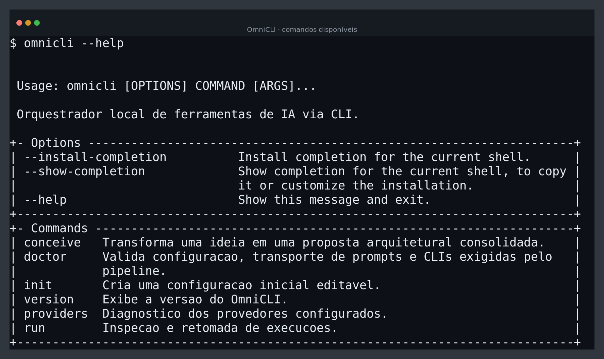
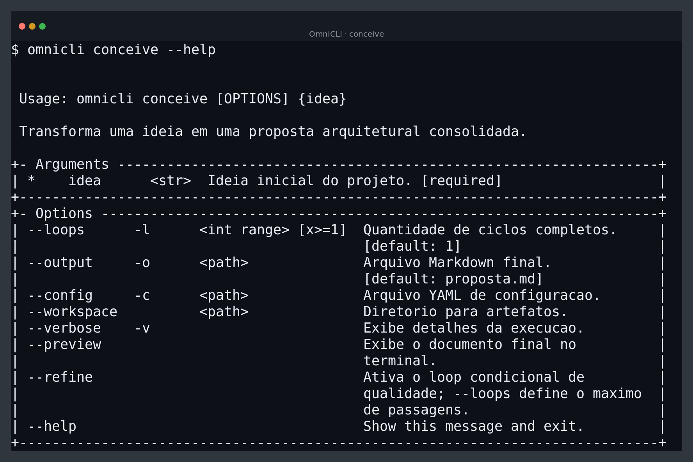
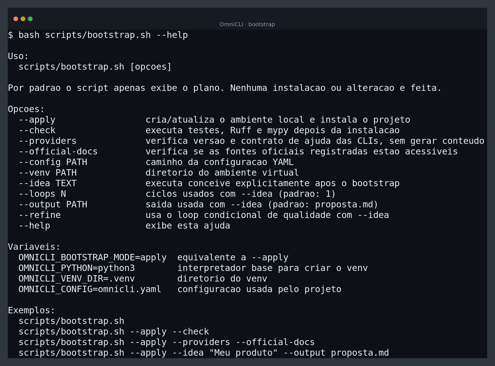

# Interface do OmniCLI

Esta página apresenta a interface de terminal do OmniCLI para quem está
conhecendo o projeto. As imagens são capturas reproduzíveis da CLI atual e
foram geradas pelo script
[`scripts/generate-doc-screenshots.sh`](../scripts/generate-doc-screenshots.sh).

## 1. Comandos disponíveis

```bash
omnicli --help
```



O ponto de entrada é `conceive`. Os comandos `doctor`, `providers`, `run`, `lab` e
`init` apoiam configuração, diagnóstico e operação sem misturar essas
responsabilidades com a geração da proposta.

## 2. Conceber uma proposta

```bash
omnicli conceive "Aplicativo de meditação gamificado" \
  --loops 3 \
  --refine \
  --output proposta.md \
  --verbose
```



O comportamento de `--loops` permanece compatível com o modo legado. A opção
`--refine` é opt-in e transforma o valor em limite de passagens para o quality
gate determinístico e o roteamento condicional documentados em
[`architecture.md`](architecture.md).

## 3. Diagnóstico sem gerar conteúdo

```bash
omnicli doctor --capabilities --json
omnicli doctor --offline --json
omnicli lab verify --json
```


O diagnóstico verifica configuração, executáveis, versões e — quando solicitado
— marcadores mínimos na ajuda local de cada CLI. A captura mostra um estado
`missing`, porque as CLIs de provedores não estão instaladas no ambiente de
geração da documentação. Depois da instalação e autenticação, os provedores
obrigatórios devem aparecer como `ready`.

Essa verificação não envia prompts, não inicia sessões e não consome quota. Para
entender os contratos por provedor, consulte
[`provider-compatibility.md`](provider-compatibility.md).

Quando não há autenticação disponível, `conceive --dry-run --json` valida o
plano sem executar provedores, e `lab verify` executa contratos sintéticos
locais. Esses resultados não comprovam compatibilidade real ou qualidade humana.

## 4. Bootstrap seguro

```bash
bash scripts/bootstrap.sh --apply --check --providers --official-docs
```



O bootstrap começa em modo de planejamento, não usa `sudo`, não instala CLIs de
provedores e não executa uma ideia sem `--idea` explícito. `--providers` faz a
validação local; `--official-docs` verifica as fontes registradas na internet.

## Regenerar as capturas

Requer Python, OmniCLI instalado no ambiente virtual e ImageMagick:

```bash
bash scripts/bootstrap.sh --apply --check
bash scripts/generate-doc-screenshots.sh
```

As imagens são exemplos de interface e podem refletir mudanças de versão. Ao
alterar comandos, opções ou mensagens públicas, regenere os arquivos e revise
esta página no mesmo pull request.
